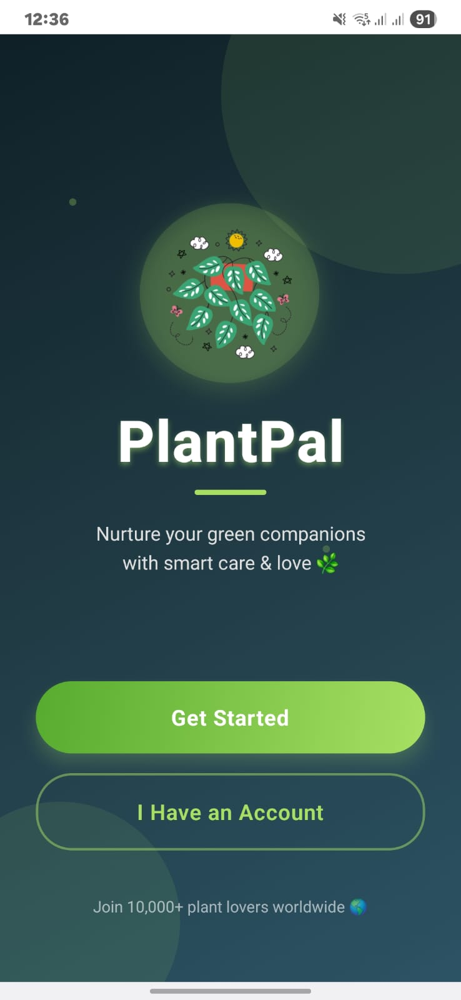
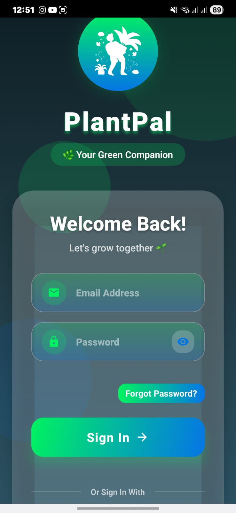
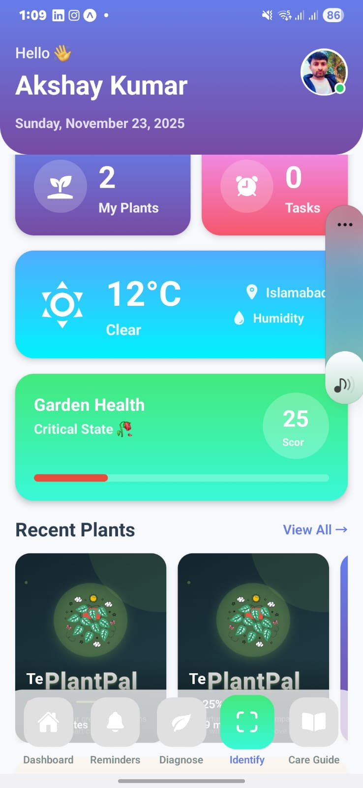
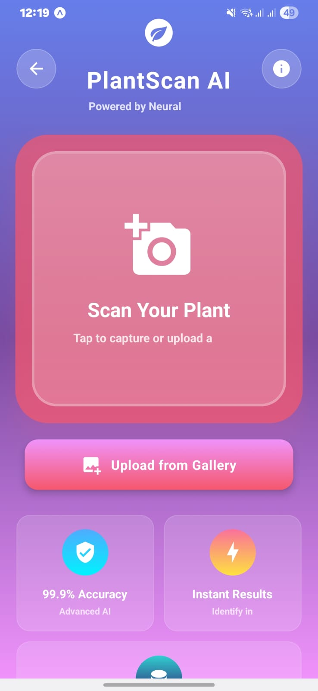
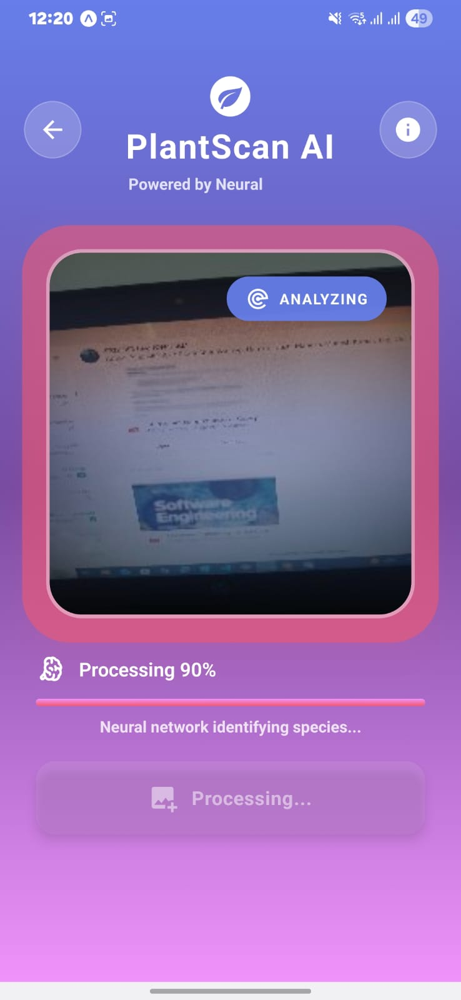
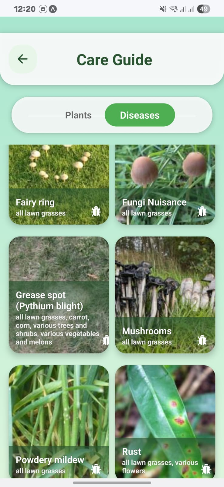
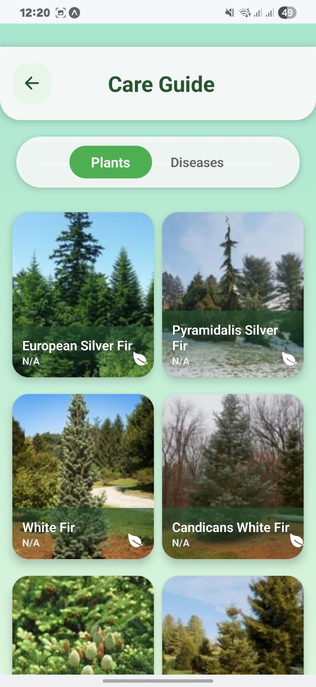
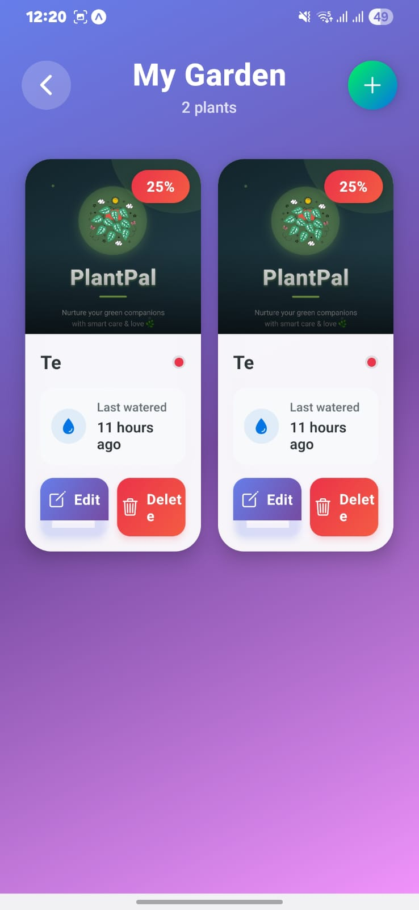
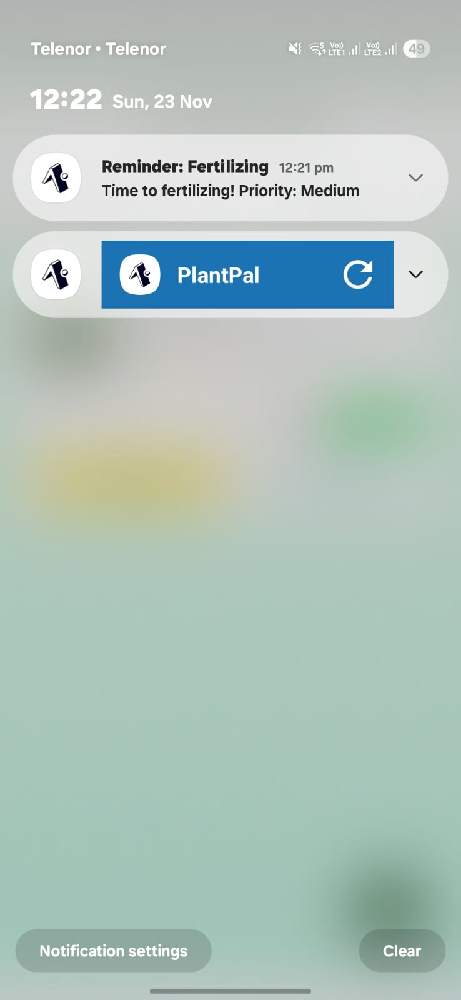
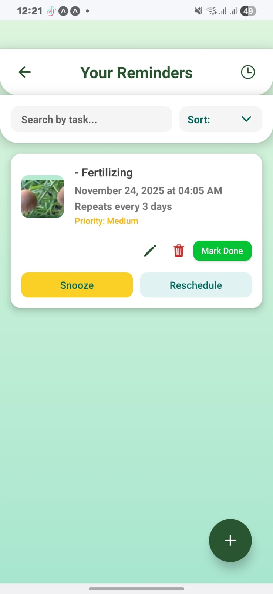

# Plant Care Hub

**Plant Care Hub** is a React Native app that helps users **identify plants**, **detect plant diseases**, and **buy or sell plants**. It also provides care guides, reminders, and chat support for plant enthusiasts.

---

## 📱 App Screenshots

### 1. Welcome Screen

### 2. Login Screen

### 3. Dashboard

### 4. Plant Detection Screen

### 5. Disease Analysis

### 6. Care Guide for Disease

### 7. Care Guide for Plant Identification

### 8. Plant Sell & Add Product

### 9. General Chat Screen

### 10. Reminder Notification

### 11. Reminder for Fertilizer or Water

---

## ⚡ Features
- **AI Plant & Disease Detection**: Identify plants and detect diseases instantly.
- **Care Guides**: Step-by-step instructions to care for plants and treat diseases.
- **Marketplace**: Buy and sell plants, seeds, and gardening products.
- **Reminders**: Schedule watering, fertilizing, or other plant care tasks.
- **Chat Support**: Communicate with experts and other users.

---

## 🛠️ Tech Stack
- **React Native**  
- **Firebase** (Authentication, Database)  
- **Expo**  

---

> Screenshots are stored in the `assets` folder.
